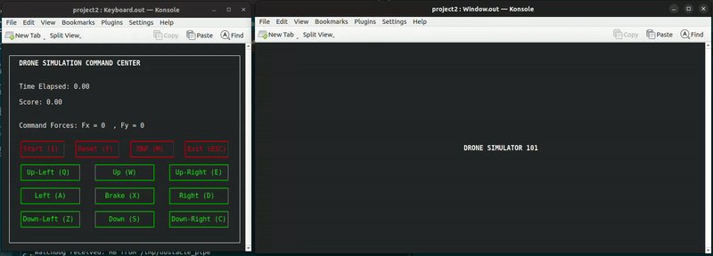
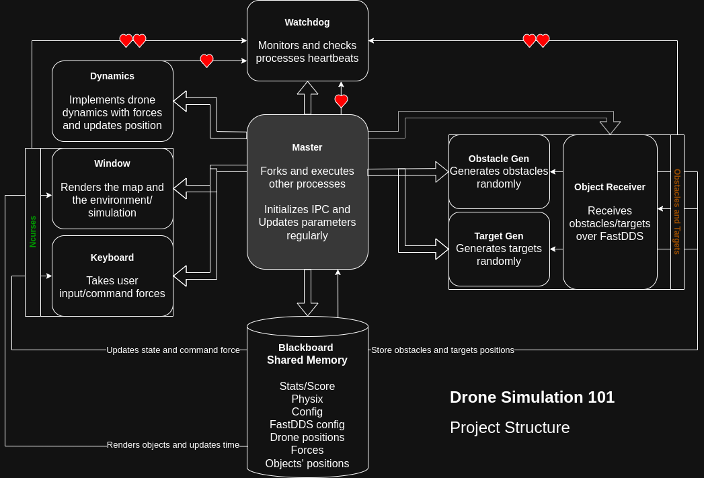
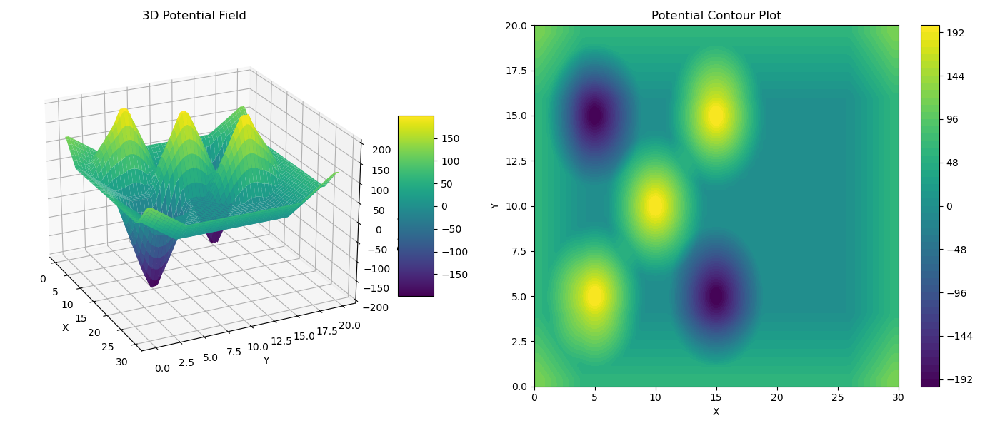

# drone-simulation-with-remote-accessibility

## Overview
This project is an interactive drone simulation that operates in a terminal-based environment using `ncurses`. The simulation consists of:

A controllable drone navigating in a bounded area, Randomly appearing and disappearing obstacles and targets, Repulsion forces following Khatib's model, Multiple modes of operation, including local and remote object generation using FastDDS.

It can be used extensively for **path-planning** of drones with respect to avoidable regions.



- **Real-time Drone Control**: Users can move the drone using keyboard input.
- **Speed Adjustment**: Pressing the same movement key repeatedly increases the drone's speed.
- **Map Visualization**: The path of the drone can be presented once it had moved a bit, using the Map key.
- **Multi-process architecture**: A master process forks and runs other processes.
- **Shared memory & IPC**: Uses shared memory structs for inter-process communication and pipes for watchdog monitoring.
- **Logging**: Logs critical simulation events.
- **Watchdog monitoring**: Ensures all processes remain active by receiving heartbeats.
- **Configurable via JSON**: Simulation parameters are dynamically loaded from `config.json`.
- **Memory Leak Checked**: Verification of memory safety using Valgrind.

## Project Structure
Each component's job is described at the end.

```
.
├── compile.sh
├── config.json
├── master
├── bins
│   ├── Blackboard.out
│   ├── Dynamics.out
│   ├── Keyboard.out
│   ├── ObjectPub.out
│   ├── ObjectSub.out
│   ├── Obstacle.out
│   ├── Target.out
│   ├── Watchdog.out
│   ├── Window.out 
├── logs
│   └── simulation.log
├── src
│   ├── Generated
│   │   ├── ....hpp
│   ├── Obstacles.idl
│   ├── ....c/h
``` 

## Simulation Dynamics

The drone operates with two degrees of freedom and follows the equation of motion:

F = M d²p/dt² + K dp/dt

Where:
- **p** = drone position
- **F** = sum of forces (control, repulsion, attraction)
- **M** = mass 
- **K** = viscous coefficient (N·s·m)

#### Khatib's Model for Obstacle Repulsion
The repulsive force \(F_r\) from an obstacle at distance \(d\) is defined as:

F_rep =
    η (1/ρ - 1/ρ₀) (1/ρ²) d,  if ρ ≤ ρ₀, 
    0,                     if ρ > ρ₀

where:
- \( \eta \) is the gain factor
- \( d_0 \) is the influence radius

Noteworthy that the repulsion force is topped at 100. Attractive forces from targets follow a (kind of) similar formulation, both detailed in `src/dynamics.c`. 

## Configuration (config.json)
The `config.json` file includes parameters such as:
```json
{
    "drone_mass": 1.0,
    "viscous_coefficient": 1.0,
    "obstacle_repulsion_gain": 0.5,
    "obstacle_influence_radius": 5.0,
    "network": {
        "domain_num":0,
        "obstacles_topic": "topic1",
        "targets_topic": "topic2",
        "ip_address": "127.0.0.1"
    }
}
```

## How to Run
#### Dependencies
- `Konsole` for terminal 
- `Ncurses` for terminal visualization
- `FastDDS` for remote communication
- `cJSON`   for reading configurations

#### Procedure
Clone the project: `git clone https://github.com/milwd/2D-Drone-Simulation-Remote.git`
0. You can generate new datatype libraries (with e.g. `fastddsgen target.idl -d src/generated/`), but it has been done already.
1. Compile the project:
   ```bash
   chmod +x compile.sh
   ./compile.sh
   ```
2. Configure the parameters in config.json: Parameters for network (domain, topics, IPs) and simulation (physics).
3. Run the simulation:
   ```bash
   ./master
   ```
4. Follow on-screen instructions to select the mode. 1 for local and 2 for remote. 
    Upon running, the user selects the operation mode:
    ```
    Choose mode of operation ...

    Mode (1): Local object generation and simulation
    - Obstacles and targets are generated by two processes locally.
    - Shared memory is used for inter-process communication.
    - The user controls the drone locally.

    Mode (2): Remote object generation and simulation
    - Obstacles and targets are received remotely via FastDDS.
    - Shared memory is used for inter-process communication.
    - The user controls the drone locally.

    Enter mode: ...
    ```

**Important Note**: for some reason, the simulation works when the konsole terminal is resized; so, upon running, resize the *window* process terminal just a bit, and when "drone simulation 101" shows blinking, you can start with the *keyboard* window. 

5. If you want to generate obstacles/targets for the online mode, just run the publish process:
   ```bash
   ./ObjectPub.out
   ```

## Memory Leak Check
Run Valgrind to verify memory safety:
```bash
valgrind --leak-check=full ./master
VALGRIND MEMORY LEAK CHECK
==5927== HEAP SUMMARY:
==5927== All heap blocks were freed -- no leaks are possible
==5927== ERROR SUMMARY: 0 errors from 0 contexts (suppressed: 0 from 0)
```

## Log of Simulation
Important checkpoints in the execution of the process will be noted in the simulation log file, located in the logs folder.
```
[2025-02-08 01:12:28] Dynamics started. PID: 13314
[2025-02-08 01:12:28] Blackboard server started. PID: 13312
[2025-02-08 01:12:28] Big brother Watchdog process is watching. PID: 13316
[2025-02-08 01:12:28] Obstacle process started. PID: 13317
[2025-02-08 01:12:28] Target process started. PID: 13318
[2025-02-08 01:12:29] Keyboard process started. PID: 13363
[2025-02-08 01:12:29] Window process started. PID: 13365
[2025-02-08 01:13:35] Drone got a target at position (9, 6)
[2025-02-08 01:14:01] Drone got a target at position (15, 3)
```

## Description of Components
#### Master
Forks and executes other processes. Initializes shared memory, pipes, etc. Also, regularly checks for updates in the config file and stores updated values in the shared memory struct; So simulation changes in the config file will have effects in the execution.

#### Watchdog
Receives/polls heartbeat notifications from other processes to assess their activity. The communication is done via pipes. 

#### Dynamics
Uses the user command forces and calculates repulsive/attractive forces to implement robot dynamics. Future drone coordinates will be calculated here and stored in the shared memory struct. Also, position bounds is checked here.

$$x_i = \frac{2m \cdot x_{i-1} + T_k \cdot x_{i-1} + F_x \cdot T^2 - m \cdot x_{i-2}}{m + T_k}$$
$$y_i = \frac{2m \cdot y_{i-1} + T_k \cdot y_{i-1} + F_y \cdot T^2 - m \cdot y_{i-2}}{m + T_k}$$

#### Window and Keyboard
The two konsole processes that use Ncurses to show the environment/map/drone/obstacles and take the possible keys. Possible keys are described in the keyboard (directions, start, exit, map, reset) window and are trivial to use. 

#### ObstacleGen and TargetGen, Object Receiver
In mode 1 (local generation and using), the two processes `Obstacle.out` and `Target.out` generate the objects and publish them to shared memory for other processes to use. The implementation is trivial, generate as many objects as specified in the config (just not more than max_objects). 
In mode 2 (remote accessibility), instead of those two, process `ObjectSub.out` runs and is able to receive objects from remote servers. In this case of course as long as there is no publisher, there will be no objects present in the environment. 
You can test the program for remote fastdds locally, by setting both receiverip and transmitterip to 127.0.0.1 in the config file, and seeing what happens.


## Final Notes
- Developed as the Advanced and Robot Programming assignments, Robotics Engineering, University of Genoa. 
- Dan Gookins' Guide to Ncurses Programming is a must read.
- Why do I have to resize the window terminal to work? I don't know yet, ask Ncurses.
- It would have been nice to be a 3D simulation -> probably.
- The drone is lagging in movement -> change mass and coefficients. 
- The map feature is weird -> I know, right?
- Is the fastdds section multithreaded and concurrent? -> it can be ... if you want.
- Can I test it with my friend's code in their computer? -> Sure, that's why fastdds is used.
- Thank you for not creating a million ncurses subwindows -> You are welcome.
- Ensure FastDDS is installed and configured properly for remote modes.
- Any comments/suggestions/issues is happily received.

---

